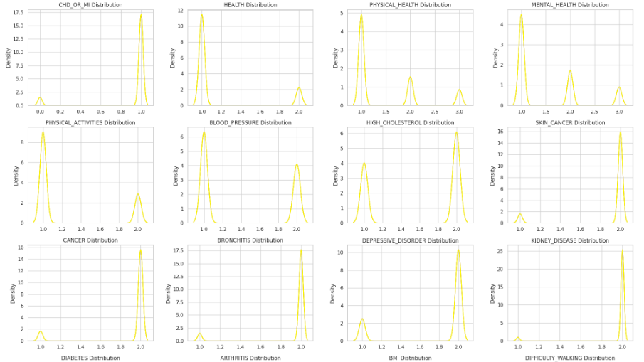
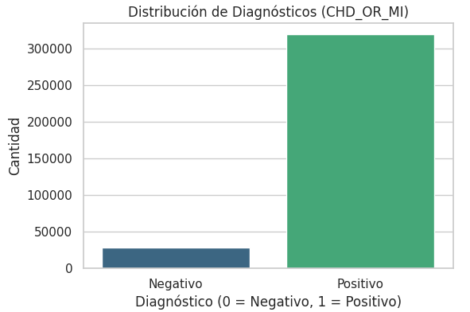
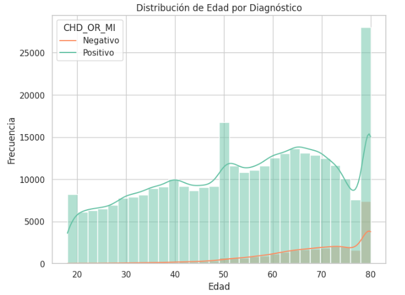
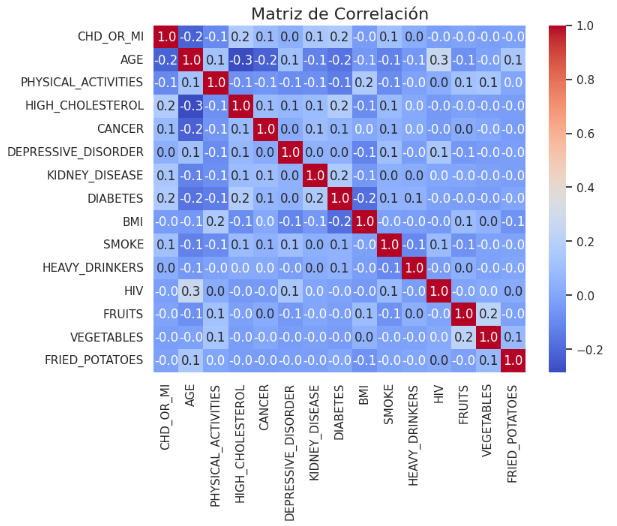
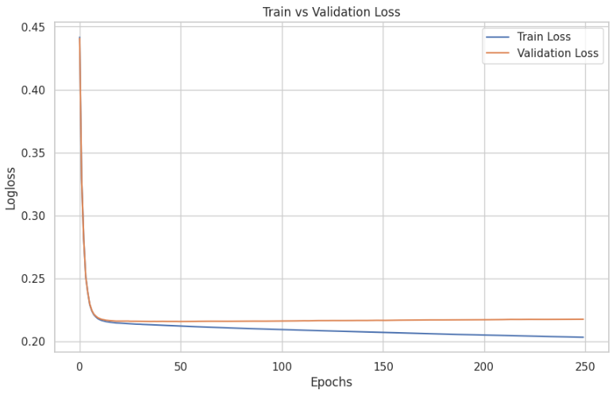

# Kaggle-competicion-Enfermedad-Coronaria

# Proyecto de Entrenamiento de Modelo para Predicción de Enfermedades Coronarias

Este proyecto tiene como objetivo desarrollar un modelo de aprendizaje automático capaz de predecir el riesgo de enfermedades coronarias basado en un conjunto de características clínicas recopiladas por llamadas telefonicas de Estados Unidos. A continuación, se describen los pasos realizados en el desarrollo del modelo.

---

## 1. Introducción

Las enfermedades coronarias, incluyendo la enfermedad de las arterias coronarias y el infarto de miocardio, representan una de las principales causas de muerte a nivel mundial. Predecir de manera temprana estos problemas cardíacos puede salvar vidas, y el uso de datos accesibles sobre el historial de salud de una persona y su estilo de vida puede hacer que estas predicciones sean más viables y escalables en la práctica clínica.. Este proyecto busca construir un modelo de clasificación que utilice datos clínicos para identificar a pacientes en riesgo.

---

## 2. Recopilación de Datos

### Fuentes de Datos
- **Dataset utilizado:** Behavioral Risk Factor Surveillance System (BRFSS) de 2022
- **Número de observaciones:** 480 000 registros
- **Número de características:** 27

### Exploración Inicial
Se realizó un análisis exploratorio para comprender la distribución de las variables, detectar valores nulos y determinar la necesidad de transformaciones.

- **Distribución de las características**
 <!-- Coloca aquí una imagen o gráfico -->

- **Diagnosticos positivos y negativos**

- **Correlación entre diagnostico y edad**

- **Matriz de correlación**

---

-**Observaciones del análisis exploratorio:**
La variable objetivo es CHD_OR_MI.

Existen 92% de registros positivos lo cual genera un desbalance con los registros negativos. 

Se utilizará validación cruzada por el alto desbalance de diagnosticos.

Existen 25 000 registros de personas de 80 años, lo cual es mas del 200% mas que otros registros.

Los registros son en su mayoria binarios y ternarios.

En el primer cuartil existe el mayor rango de poblacion de 18 a 40.

La edad es un factor importante, se concluye que a mayor edad mayor probabilidad de sufrir enfermedad.

Gran cantidad de valores NAN, se realizara una imputación de los datos de acuerdo a la correlación que tengan entre caracteristicas, los métodos para la imputacion de datos 
elegidos son, regresion logistica para las variables categoricas que tienen mucha relacion con otras variables, regresion lineal para IBM, y la moda para FRUITS y VEGETABLES.

Debido a la calidad de los datos, se utilizará una red CatBoosClassifier.

## 3. Preprocesamiento de Datos

### Limpieza de Datos
- Imputación de valores nulos.
- Tratamiento de valores atípicos.
- Normalización de variables numéricas.

### Codificación
- Variables categóricas transformadas mediante one-hot-encoding.

### División del Dataset
El dataset fue dividido en:
- **70%** para entrenamiento.
- **30%** para validación.

---

## 4. Selección del Modelo

Se evaluaron diferentes algoritmos para determinar el más adecuado:
- **CatBoosClassifier.**

### Métrica de Evaluación
Se utilizó la métrica **F1-score** para medir el desempeño del modelo.

---

## 5. Entrenamiento del Modelo

### Resultados del Entrenamiento

- **F1-score:** 0.9583
- **AUC-ROC:** 0.8478

<!--   Coloca aquí una curva ROC -->

---

## 6. Evaluación del Modelo

Se evalua la generalización del modelo(overfiting y underfiting). Se muestra el mismo comportamiento de la perdida del error en el entrenamiento y validación.

 <!-- Coloca aquí una imagen de resultados -->

---

## 7. Implementación

Se desplegó el modelo en un entorno productivo mediante [inserta plataforma, e.g., Flask, AWS Lambda]. El modelo está preparado para recibir datos en tiempo real y devolver predicciones.

---

## 8. Conclusiones

El modelo desarrollado muestra un alto potencial para apoyar a los profesionales médicos en la identificación temprana de enfermedades coronarias. Las próximas iteraciones del proyecto incluirán:
- Uso de datos adicionales para mejorar el desempeño.
- Implementación de interpretabilidad del modelo.

---

<!--
## 9. Referencias

- [Inserta aquí referencias relevantes]

---

## Anexos

Incluye aquí cualquier información adicional que pueda ser relevante.

---

*¡Completa los espacios con imágenes, gráficos y resultados obtenidos!*
-->
